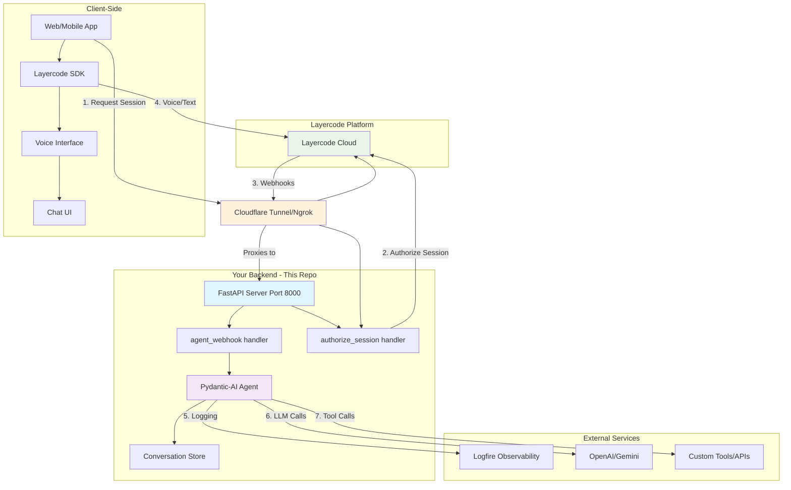

# Layercode FastAPI Voice Agent Backend

A production-ready FastAPI backend that integrates with [Layercode](https://layercode.com) to build voice-powered AI agents. This example uses Pydantic-AI for agent logic with observability powered by Logfire.

## TLDR

Got [uv](https://github.com/astral-sh/uv) installed? Launch your first voice agent in seconds:

```bash
# Terminal 1: Start the server
make server

# Terminal 2: Expose it to Layercode
make tunnel
```

Then test your voice agent in the [Layercode playground](https://dash.layercode.com/)!

### Tips

**For the best voice experience**: Switch to Gemini 2.5 Flash Lite! While this demo uses GPT-4o mini with low verbosity and minimal reasoning, you'll still notice some response delay. Gemini 2.5 Flash Lite offers significantly better conversation latency and creates a more natural voice interaction. See the [Customization](#customization) section below to change your LLM provider.

## Architecture



## What is Layercode?

[Layercode](https://layercode.com) is a platform that makes it easy to add voice and conversational AI to your applications. It handles:

- **Voice processing**: Speech-to-text and text-to-speech
- **Session management**: Secure client sessions and conversation state
- **Streaming**: Real-time bidirectional communication
- **Multi-channel**: Web, mobile, and phone support

Your backend receives webhook events and responds with streaming text that Layercode converts to speech.

## Features

- **FastAPI Backend**: Modern async Python web framework
- **Pydantic-AI Integration**: Type-safe AI agent framework
- **Layercode Utils**: Unofficial Python utilities for webhook handling (`layercode_sdk.py`)
- **Streaming Responses**: Real-time SSE (Server-Sent Events) streaming
- **Signature Verification**: Secure webhook authentication
- **Conversation History**: In-memory message history (easily adaptable to any DB/KV store)
- **Observability**: Logfire integration for monitoring and debugging
- **Type Safety**: Full Pydantic validation for all payloads

## Prerequisites

- Python 3.10+ (or modify `pyproject.toml` for your version)
- [uv](https://github.com/astral-sh/uv) - Fast Python package installer and resolver
- A Layercode account - Sign up at [layercode.com](https://layercode.com) or go directly to [dash.layercode.com](https://dash.layercode.com/)
- OpenAI API key (or configure another LLM provider)

## Installation

### 1. Install uv

```bash
# macOS/Linux
curl -LsSf https://astral.sh/uv/install.sh | sh

# Windows
powershell -c "irm https://astral.sh/uv/install.ps1 | iex"
```

### 2. Clone and Setup

```bash
git clone <your-repo>
cd python-fastapi-backend

# Install dependencies (uv will create a virtual environment automatically)
uv sync
```

### 3. Configure Environment Variables

Create a `.env` file in the project root:

```bash
# Required: Get these from https://dash.layercode.com/
LAYERCODE_API_KEY=your_api_key_here
LAYERCODE_WEBHOOK_SECRET=your_webhook_secret_here

# Required: OpenAI API key for the LLM
OPENAI_API_KEY=your_openai_key_here

# Required: Logfire token for observability
# Get your token from https://logfire.pydantic.dev/
LOGFIRE_TOKEN=your_logfire_token_here

# Optional: Server configuration
HOST=0.0.0.0
PORT=8000
UVICORN_RELOAD=0
```

### 4. Create a Layercode Agent

1. Go to [dash.layercode.com](https://dash.layercode.com/)
2. Create a new agent
3. Copy the agent ID and add it to your `.env` file as `LAYERCODE_AGENT_ID`
4. Configure the agent to use webhook URL (will be set up via tunnel)

## Running the Application

You need **two terminals** running simultaneously:

### Terminal 1: Start the FastAPI Server

```bash
# Using uv
uv run uvicorn main:app --host 0.0.0.0 --port 8000 --reload

# Or using the Makefile
make server
```

The server will start on `http://0.0.0.0:8000`

### Terminal 2: Start the Layercode Tunnel

The tunnel exposes your local server to Layercode's cloud platform:

```bash
# If you did not set LAYERCODE_AGENT_ID in .env
npx @layercode/cli tunnel --agent=mxdi9mls --port=8000

# Or if you have LAYERCODE_AGENT_ID set in .env:
npx @layercode/cli tunnel --port=8000

# Or using the Makefile
make tunnel
```

This command will:
- Connect your local server to Layercode's platform
- Automatically configure the webhook URL for your agent
- Display a public tunnel URL in the logs (also visible in [dash.layercode.com](https://dash.layercode.com/))
- Keep the tunnel open while you develop

**Important**:
- Note the tunnel URL from the logs (e.g., `https://your-tunnel.trycloudflare.com`)
- When you're done, press `CTRL+C` in Terminal 2 to stop the tunnel

## Testing Your Agent

### Step 1: Test Local API

First, verify your FastAPI server is working locally:

```bash
curl http://localhost:8000/health
# Response: {"status":"ok"}
```

### Step 2: Test Tunnel Connection

After starting the tunnel, test that it's properly forwarding requests:

1. Look at the tunnel logs - you'll see a URL like: `https://your-tunnel.trycloudflare.com`
2. You can also find this URL in your [Layercode dashboard](https://dash.layercode.com/)
3. Test the tunnel by visiting: `https://your-tunnel.trycloudflare.com/health`
4. You should see: `{"status":"ok"}`

If the local test works but the tunnel test doesn't, check:
- Both terminals are running (server + tunnel)
- The tunnel is connected (check the tunnel logs)
- The port number matches (default: 8000)

### Step 3: Test Voice Agent

Once the tunnel is working, test your agent in the Layercode Playground:

1. Go to: `https://dash.layercode.com/agents/<your-agent-id>/playground`
   - Example: `https://dash.layercode.com/agents/mxdi9mls/playground`
2. Click the microphone or type a message
3. Your FastAPI backend will receive the webhook and respond

## Project Structure

```
python-fastapi-backend/
├── main.py                 # FastAPI application and webhook handlers
├── layercode_sdk.py        # Layercode utilities (signature verification, streaming)
├── pyproject.toml          # Python dependencies (uv)
├── .env                    # Environment variables (not in git)
├── Makefile                # Common commands
└── README.md               # This file
```

## Layercode SDK Utilities (`layercode_sdk.py`)

All Layercode-specific utilities are isolated in `layercode_sdk.py`:

### `verify_signature(payload, signature, secret)`
Verifies webhook authenticity using HMAC-SHA256. Protects against:
- Replay attacks (timestamp validation)
- Unauthorized requests (signature validation)

### `stream_response(request_body, handler)`
Creates SSE (Server-Sent Events) responses for Layercode. Returns a `StreamingResponse` compatible with FastAPI.

### `StreamHelper`
Helper class with methods:
- `tts(text)`: Send text-to-speech chunks
- `data(metadata)`: Send structured data/metadata
- `end()`: Close the stream

## Webhook Events

Your `/api/agent` endpoint receives these event types:

| Event Type | Description | Response Required |
|------------|-------------|-------------------|
| `session.start` | New conversation started | Optional welcome message |
| `message` | User sent a message | Required: LLM response |
| `session.end` | Conversation ended | Optional cleanup |
| `session.update` | Session metadata changed | Optional handling |

## Customization

### Change the LLM Model

```python
# Use GPT-5 nano (default)
TEXT_MODEL = "openai:gpt-5-nano"

# Use Gemini -- requires GEMINI_API_KEY in .env
TEXT_MODEL = "google-gla:gemini-2.5-flash-lite" 
```

### Add Custom Tools

Pydantic-AI supports tool calling. Add to `main.py`:

```python
from pydantic_ai import RunContext

@agent.tool
async def get_weather(ctx: RunContext, location: str) -> str:
    """Get weather for a location."""
    # Your API call here
    return f"Weather in {location}: Sunny, 72°F"
```

### Use Persistent Storage

Replace the in-memory store in `main.py:54-56` with Redis or a database:

```python
# Example with Redis
import redis.asyncio as redis

async def get_conversation_history(conversation_id: str) -> List[ModelMessage]:
    client = redis.from_url("redis://localhost")
    data = await client.get(f"conv:{conversation_id}")
    return json.loads(data) if data else []
```

## Makefile Commands

```bash
# Start the FastAPI server
make server

# Start the Layercode tunnel (requires LAYERCODE_AGENT_ID in .env)
make tunnel

# Format code with ruff
make format

# Lint code with ruff
make lint

# Run both format and lint
make check
```

## Development Workflow

1. **Start development**: Open two terminals
   ```bash
   # Terminal 1
   make server

   # Terminal 2
   make tunnel
   ```

2. **Make changes**: Edit `main.py` or `layercode_sdk.py`
   - Server auto-reloads on file changes (if `--reload` is enabled)

3. **Test changes**: Use the playground at `https://dash.layercode.com/agents/<agent-id>/playground`

4. **Stop development**: Press `CTRL+C` in both terminals

## Environment Variables Reference

| Variable | Required | Description | Example |
|----------|----------|-------------|---------|
| `LAYERCODE_API_KEY` | Yes | API key from dashboard | `lc_abc123...` |
| `LAYERCODE_WEBHOOK_SECRET` | Yes | Webhook signing secret | `whsec_abc123...` |
| `LAYERCODE_AGENT_ID` | No | Default agent ID | `dtv3x3d2` |
| `OPENAI_API_KEY` | Yes* | OpenAI API key | `sk-proj-...` |
| `LOGFIRE_TOKEN` | Yes | Logfire observability token | `pylf_v1_us_...` |
| `HOST` | No | Server bind address | `0.0.0.0` |
| `PORT` | No | Server port | `8000` |
| `UVICORN_RELOAD` | No | Enable auto-reload | `1` or `0` |

*Required if using OpenAI models. Configure different provider as needed.

### Getting a Logfire Token

Logfire provides observability for your AI agent, letting you monitor requests, responses, and performance in real-time.

**Good news**: Logfire offers a generous free tier! Sign up at [logfire.pydantic.dev](https://logfire.pydantic.dev/) to get started.

1. Go to [logfire.pydantic.dev](https://logfire.pydantic.dev/)
2. Sign up for a free account (no credit card required)
3. Create a new project
4. Copy the token and add it to your `.env` file as `LOGFIRE_TOKEN`

The free tier includes a very generous quota that's perfect for development and small production workloads.

## Troubleshooting

### "LAYERCODE_WEBHOOK_SECRET is not configured"
Add the secret to your `.env` file. Get it from the Layercode dashboard.

### "Invalid signature"
- Check that `LAYERCODE_WEBHOOK_SECRET` matches the dashboard
- Ensure the webhook is coming from Layercode (not a direct curl)
- Check that the tunnel is properly configured

### "Unable to reach Layercode API"
- Verify your `LAYERCODE_API_KEY` is correct
- Check your internet connection
- Ensure the Layercode API is operational

### Tunnel connection issues

**Step-by-step debugging**:

1. **Test locally first**: Run `curl http://localhost:8000/health`
   - If this fails, your FastAPI server isn't running properly
   - Check Terminal 1 for errors

2. **Test the tunnel**: Get the tunnel URL from the logs or dashboard
   - Visit `https://your-tunnel.layercode.dev/health` in your browser
   - If this fails but local works, the tunnel isn't forwarding properly

3. **Common tunnel issues**:
   - Port 8000 is already in use (change with `--port=8001`)
   - Agent ID is incorrect (check `LAYERCODE_AGENT_ID` in `.env`)
   - Outdated CLI (run `npx @layercode/cli@latest tunnel`)
   - Firewall blocking the connection

### Agent not responding
- Check both terminals are running (server + tunnel)
- Look for errors in the FastAPI logs
- Test the health endpoint: `curl http://localhost:8000/health`

## Production Deployment

For production:

1. **Remove `--reload`** from uvicorn command
2. **Use proper secrets management** (not `.env` files)
3. **Deploy with a proper tunnel alternative**:
   - Use ngrok with a reserved domain
   - Deploy to a cloud provider with a public URL
   - Use Layercode's hosted option (if available)
4. **Add persistent storage** for conversation history
5. **Configure proper logging** and error tracking
6. **Set up monitoring** with Logfire or similar
7. **Add rate limiting** and request validation
8. **Use environment-specific configs**

Example production command:

```bash
uv run uvicorn main:app --host 0.0.0.0 --port 8000 --workers 4
```

## Resources

- [Layercode Website](https://layercode.com)
- [Layercode Documentation](https://layercode.mintlify.app/tutorials/getting-started)
- [Layercode Dashboard](https://dash.layercode.com/)
- [FastAPI Documentation](https://fastapi.tiangolo.com/)
- [Pydantic-AI Documentation](https://ai.pydantic.dev/)
- [uv Documentation](https://docs.astral.sh/uv/)

## License

MIT

## Support

For issues with:
- **This template**: Open an issue in this repository
- **Layercode platform**: Check the [docs](https://layercode.mintlify.app/tutorials/getting-started) or visit [layercode.com](https://layercode.com)
- **Pydantic-AI**: Check [Pydantic-AI docs](https://ai.pydantic.dev/)
